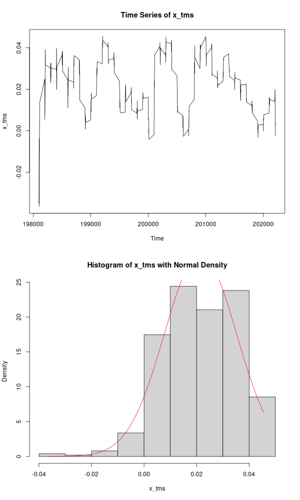
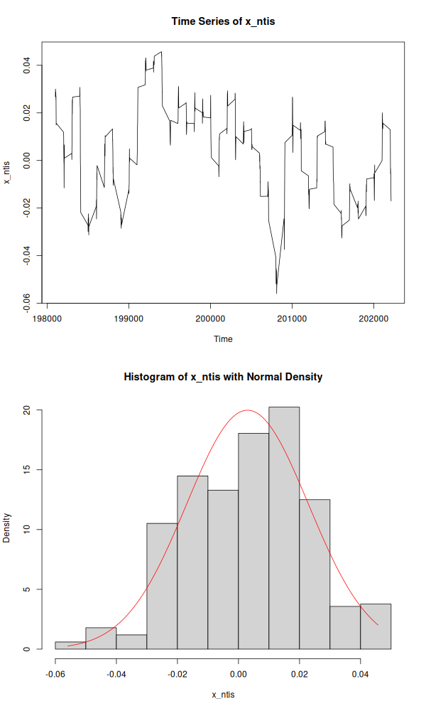
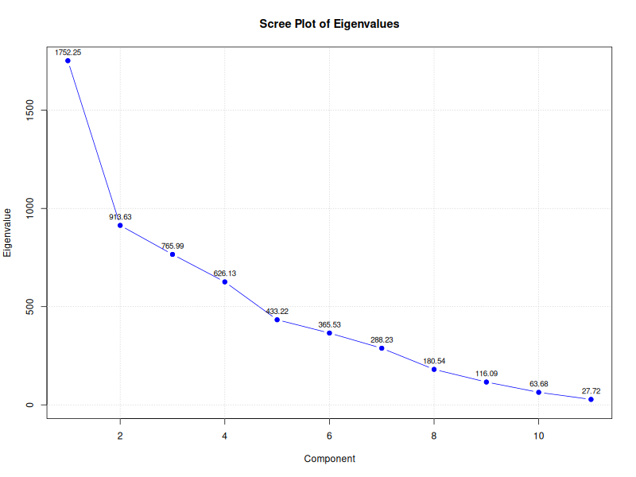

# Homework: 2024/9/4

## 1. Data Visualization
plot for y

plot for x_dfy

plot for x_infl

plot for x_svar

plot for x_tms

plot for x_tbl

plot for x_dfr

plot for x_dp

plot for x_ltr

plot for x_ep

plot for x_bmr

plot for x_ntis

## 2. 
2.1. $trace(X(X'X)^{-1}X') = 11$ (calculated by R)

2.2. $trace(I_{n} - X(X'X)^{-1}X') = 493$ (calculated by R)

## 3. Eigenvalue Scree Plot
eigenvalues scree plot (sorted)

## 4. Standardized Matrix Comparison
scree plot of the eigenvalues of X̄'X̄

scree plot of the eigenvalues of X̄X̄'

**The results imply that the eigenvalues of the two matrix are the same.**

## 5. Spectral Decomposition and Matrix Inversion
Apply the equation

$H = \widetilde{X'}\widetilde{X}$

$A = HΛ^{-1}H'$

The result turns out AA⁻¹ = Iₖ (verified by R)

## 6. Linear Equation Solution
Since X isn't a symmetric matrix, we must apply another method to calculate b. By using the below equation, we can figure out b.

$b = \left( \widetilde{X}'\widetilde{X} \right)^{-1}\widetilde{X'}Y$

The result of b

