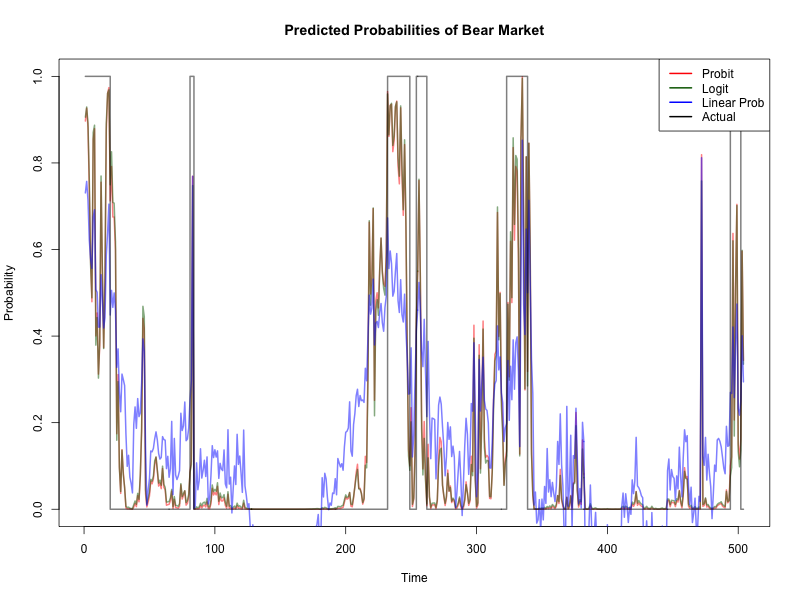
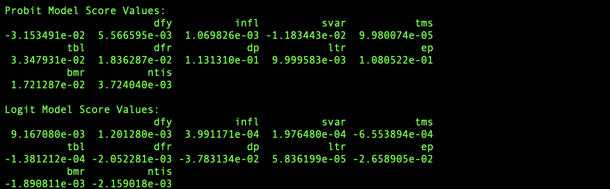

<!--   -->

# Homework: 2024/11/27

## 1. Information Matrix of Binary Choice Models

## 2. 

**market-cycle-index sequence & its predictions of different models**

**Score values of probit and logit models**

By observing the score values, we can see that the score values of probit and logit models are close to zero, which indicates that the numerical optimization is successfully converged.

## 3. Source Code

[Source Code](https://github.com/lin-1214/2024Econometric/blob/main/hw10/homework10.r)
 
