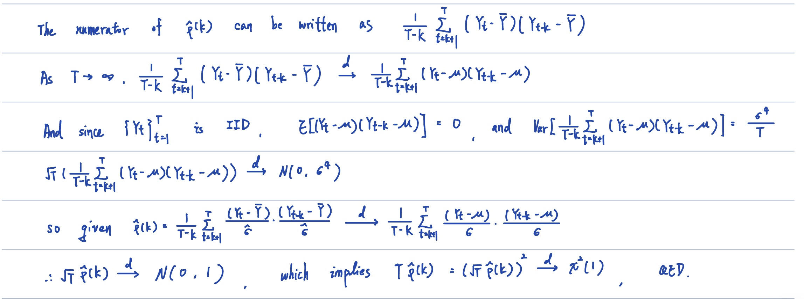
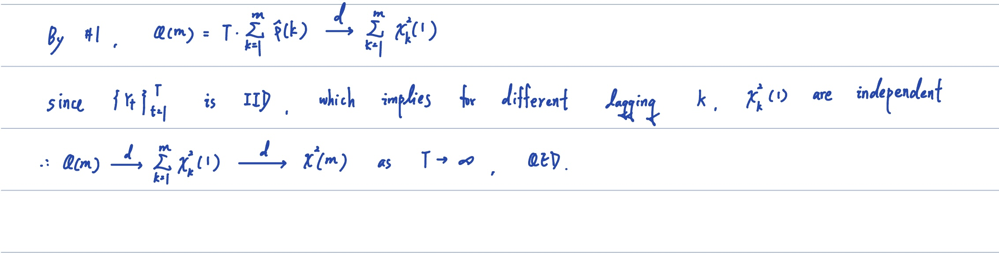
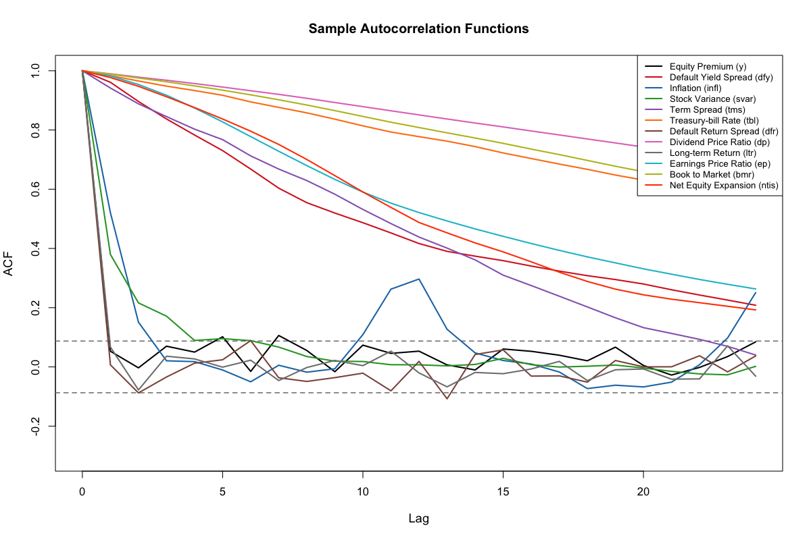
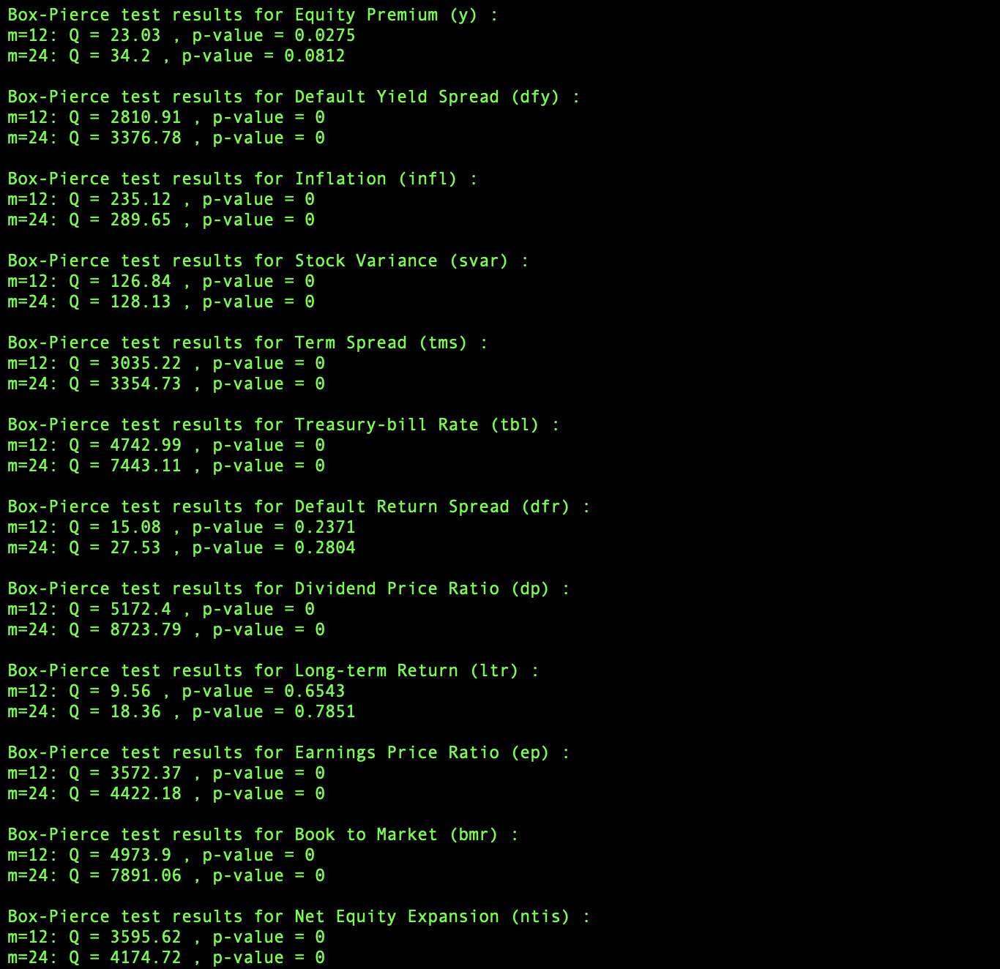

 

# Homework: 2024/12/04

## 1. Prove the asymptotic distribution of $T\hat{\rho}^2(k)$

## 2. Prove the asymptotic distribution of Box-Pierce statistic

## 3. Plot the sample autocorrelation function and test the null of IIDness for each of the 12 time series

`Plot of sample autocorrelation function`

`Test the null of IIDness for each of the 12 time series`

We can see that the Box-Pierce statistic implies that the null of IIDness is rejected for most of the time series. For dfr & ltr, the null of IIDness is not rejected at 5% level, which implies that these two time series are IID. And for y, the null of IIDness is rejected when m=12, but not when m=24.

## 4. Source Code

[Source Code](https://github.com/lin-1214/2024Econometric/blob/main/hw11/homework11.r)
