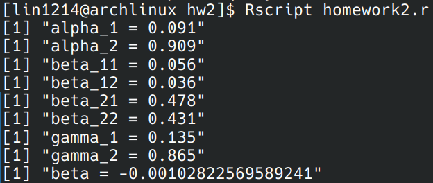

# Homework: 2024/9/11

## 1.

## 2.

## 3.

---

## 4.
Apply the law of total probability, we can count each probability that satisfies the condition:

---

## 5.

---

## 6.

We can then calculate beta by constructing the linear model with X and Y:

## 7. Source Code
[Source Code](https://github.com/lin-1214/2024Econometric/blob/main/hw1/homework2.r)

