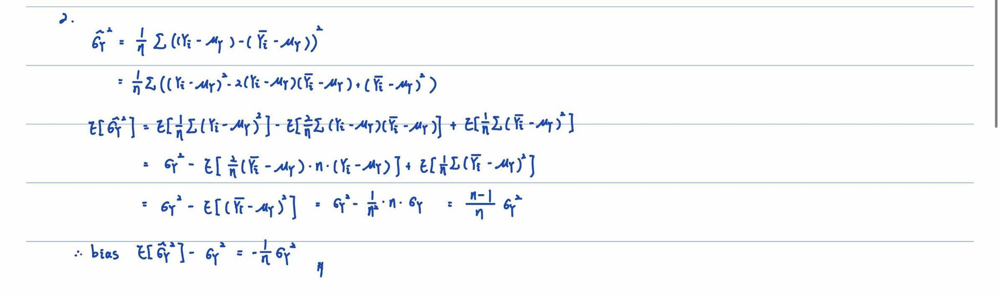
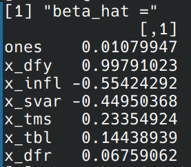
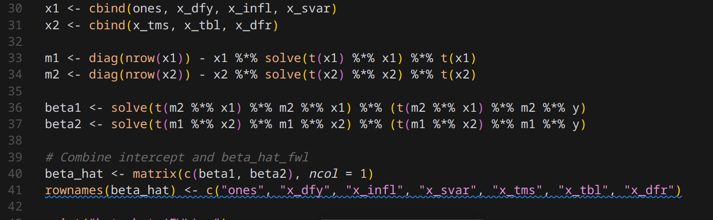
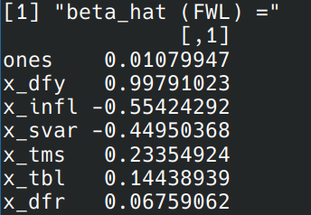
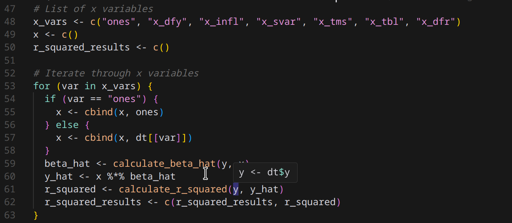
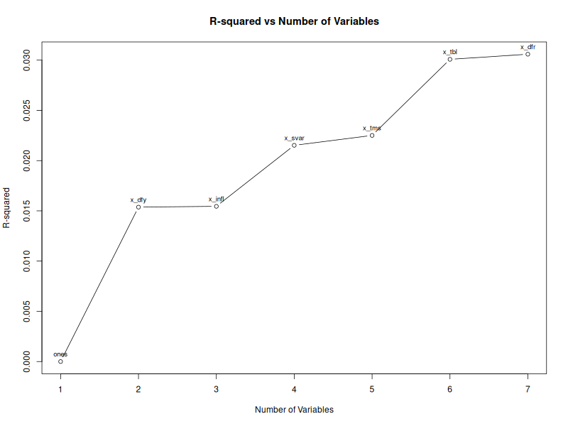

# Homework: 2024/09/18

## 1. 

---

## 2.

---

## 3.
caluculate beta using the formula $$(X'X)^{-1} (X'Y)$$

calculate beta using the FWL theorem

---

## 4.
calculate each r-squared

result of r-squared

plot of r-squared

