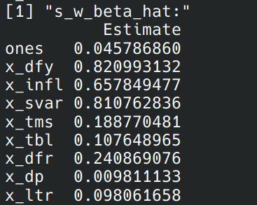
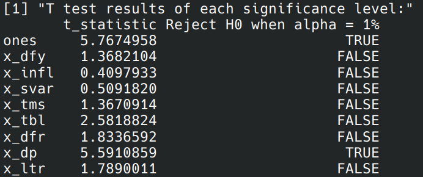

 

# Homework: 2024/10/9

### 1. Result of each value
Result of $\hat{\beta}_j$ 

Result of $s(\hat{\beta}_j)$

Result of $s^W(\hat{\beta}_j)$

---

### 2. Result of each t-statistic and hypothesis test

$alpha = 1$ %

$alpha = 5$ %

$alpha = 10$ %

---

### 3. Result of Jarque-Bera test & Comparison of N(0, 1) and error-term distribution

Result of Jarque-Bera test and hypothesis test

Comparison of N(0, 1) and error-term distribution

    The result rejects the null hypothesis of the Jarque-Bera test at the 1% significance level, indicating that the error term is not normally distributed. 

    According to the skewness = -0.42 and kurtosis = 4.68 of the error term, the error term is more peaked and skewed to the left compared to the normal distribution.

    In addition, the skewness and kurtosis of N(0, 1) are 0 and 3, respectively.

---

### 4. Source Code
[Source Code](https://github.com/lin-1214/2024Econometric/blob/main/hw5/homework5.r)