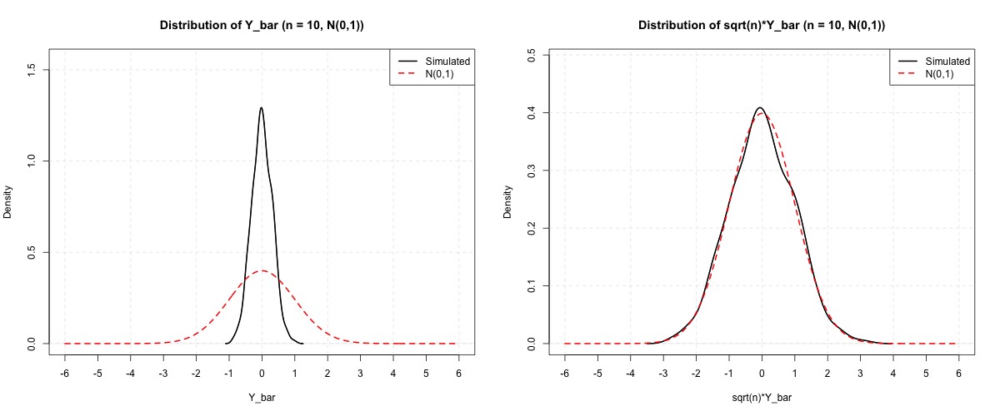
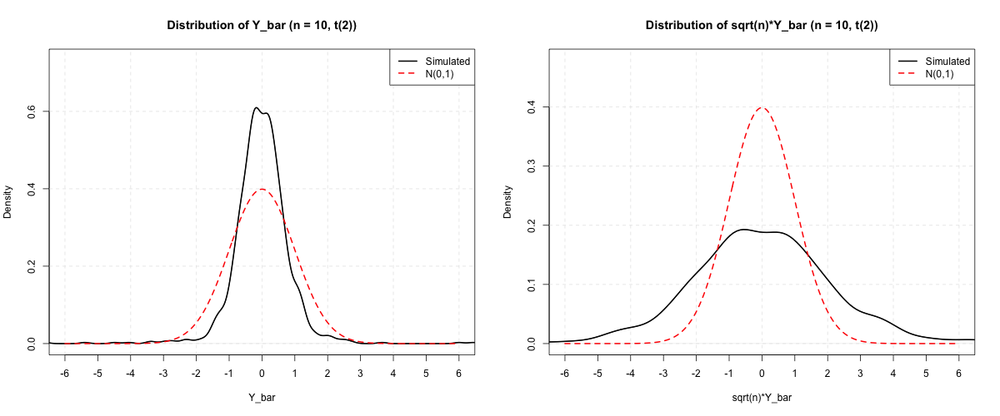
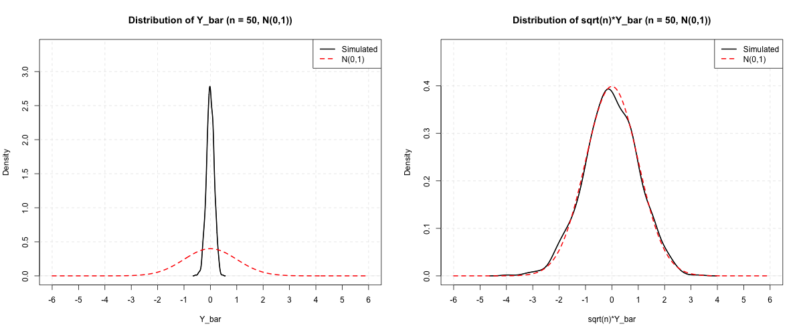
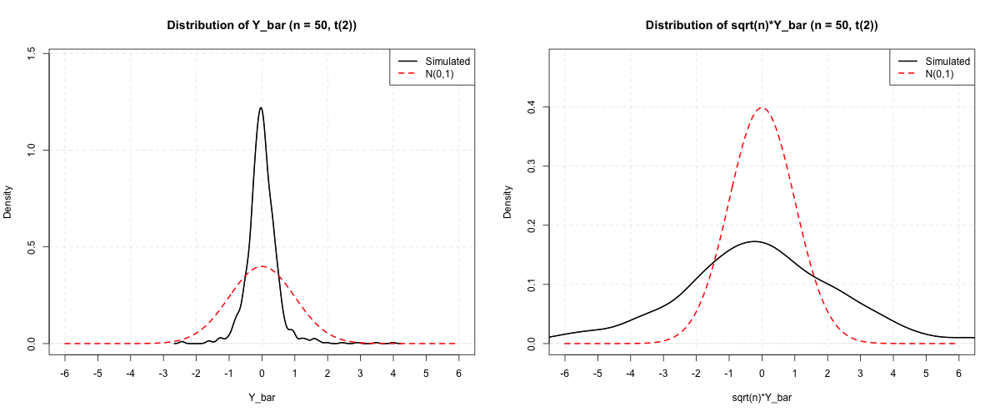
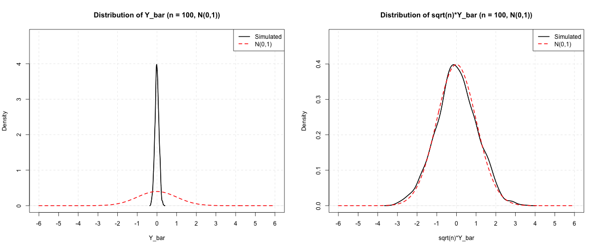
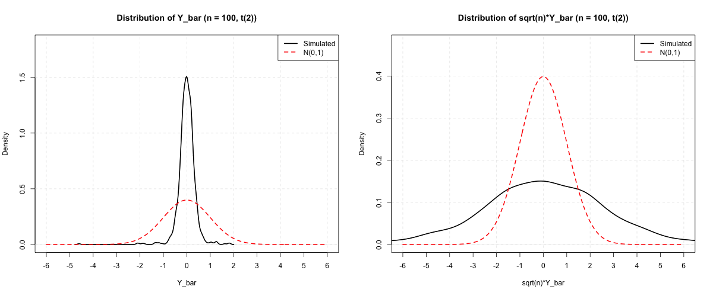
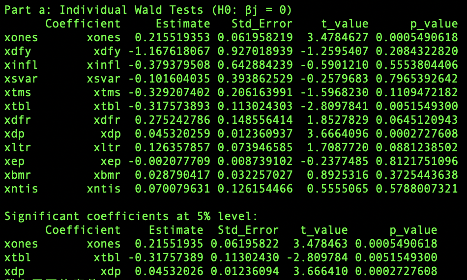
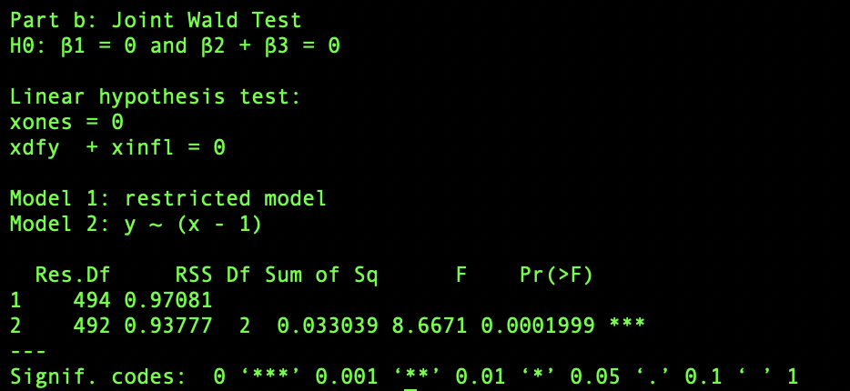

 
# Homework: 2024/10/30

## 1. 
#### Result for $n = 10$

#### Result for $n = 50$

#### Result for $n = 100$

By these simulations, we can see that the distribution of $n^{1/2} \bar{Y}$ is closer to the normal distribution than the distribution of $\bar{Y}$ for both $N(0, 1)$ and $t(2)$ distributions.

As the sample size $n$ increases, we can see there's a peak at the center of the density function of $\bar{Y}$, this is because the variance of $\bar{Y}$ decreases as $n$ increases.

Comparing the density functions of $n^{1/2} \bar{Y}$ when applying $N(0, 1)$ and $t(2)$ distributions, we can see that when applying $N(0, 1)$ distribution, the density function of $n^{1/2} \bar{Y}$ is more similar to the normal distribution. But when $n$ goes to infinity, both of the density function will be like the distribution of $N(0, 1)$ according to the central limit theorem.

---

## 2.
#### Result of individual Wald tests

According to the result of individual Wald tests, we can see that the p-values of intercept, tbl, xdp are less than 0.05, which means we can reject the null hypothesis of these coefficients.

#### Result of joint Wald tests

According to the result of joint Wald tests, we can see that the p-value is less than 0.05, which means we can reject the null hypothesis. The statistical meaning of this result is we reject that $\beta_{1} = 0$ and (or) $\beta_{2} + \beta_{3} = 0$ at 5% significance level. We can see the result is aligned to the result of individual Wald tests of $\beta_{1}$. 

---

## 3. Source Code
[Source Code](https://github.com/lin-1214/2024Econometric/blob/main/hw6/homework6.r)