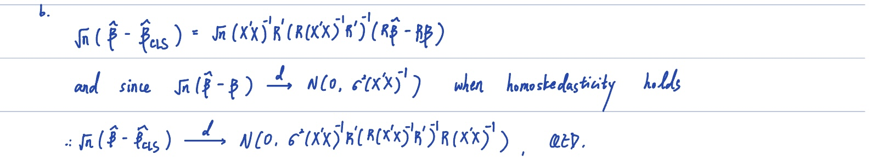
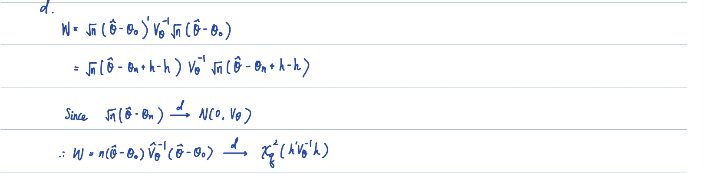
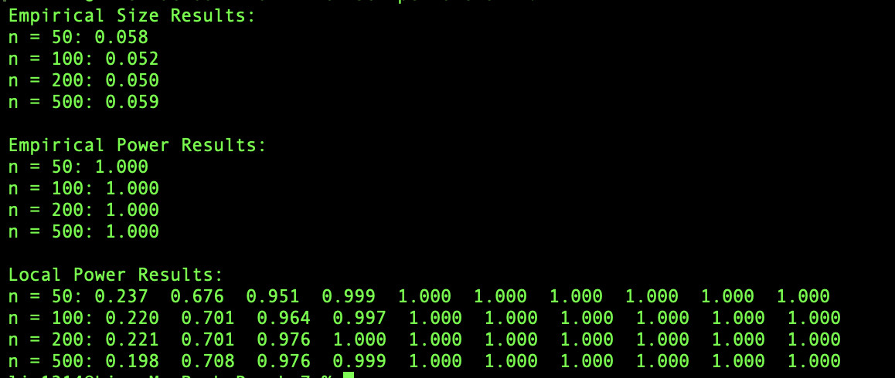

<!--   -->

# Homework: 2024/11/6
## Question 1

## Question 2
#### Result for Simulation

#### a. 
`The empirical size remains stable and close to the nominal 5% level across all sample sizes`, indicating that the test maintains good size control. This validates the asymptotic distribution derived in Question 1(c) under the null hypothesis.

#### b.
The test demonstrates perfect power (100%) across all sample sizes when $ β = (1,2,3,4,5)' $. This indicates that the test has `excellent ability to detect significant deviations from the null hypothesis`, even with smaller sample sizes.

#### c. 
The local power analysis reveals:
- For h = 1: Power is moderate (around 20%)
- For h = 2: Power increases substantially (around 70%)
- For h ≥ 3: Power approaches or reaches 100%
- The pattern is `consistent across sample sizes, confirming the theoretical results from Question 1(d)` regarding the test's behavior under local alternatives

These findings confirm that the test is reliable for practical applications, providing good size control while maintaining strong power against both fixed and local alternatives.

