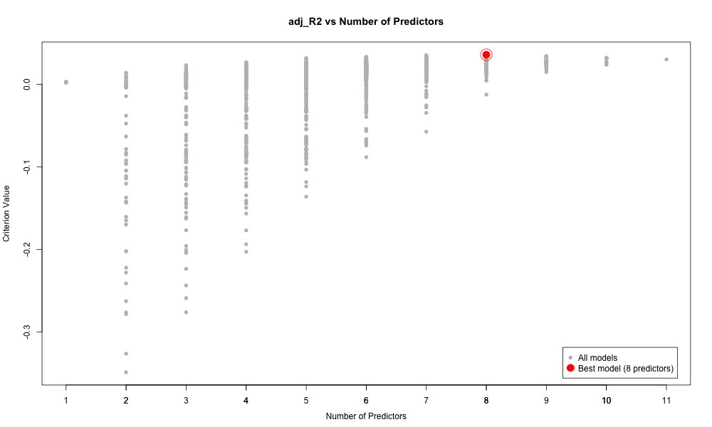
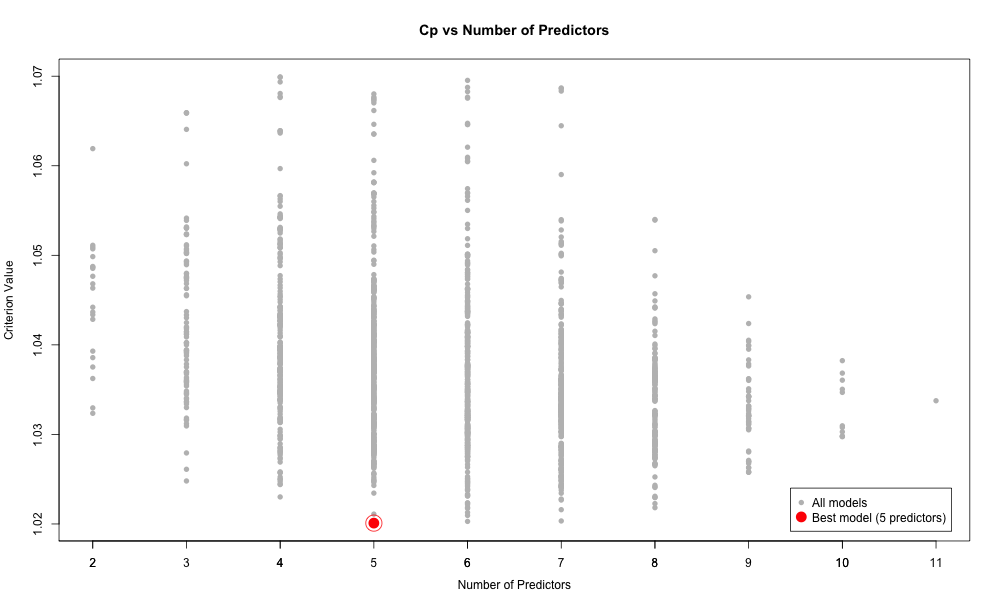

<!--   -->

# Homework: 2024/11/13
## 1. 

## 2.

## 3. Model Selection
#### Plot of R2

#### Plot of Adjusted_R2

Observing the plots of R2 and adjusted R2, we can see the trend of R2 is the same as adj_R2, as the model complexity increases, criterion value of R2 and adj_R2 tend to increase. The difference is that the criterion value of adjusted R2 is affected by the model complexity, while the criterion value of R2 is not. The best model selected by R2 and adj_R2 are the model that has the largest criterion value.

#### Plot of AIC

#### Plot of BIC

Observing the plots of AIC and BIC, we can see that the model selected are different from R2 and adjustet R2. Since AIC and BIC adds a penalty for the model complexity, the model selected by AIC and BIC are usually have smaller model complexity than that selected by R2 and adjusted R2. The best model selected by AIC and BIC are the model that has the smallest criterion value.

#### Plot of Cp

#### Plot of LOOCV

 The best model selected by Cp and LOOCV are the model that has the smallest criterion value.

#### Result of Model Selection

Number of predictors that the best model selected
- R2: 11 (predictors)
- Adjusted_R2: 8
- AIC: 5
- BIC: 2
- Cp: 5
- LOOCV: 5

Also, we can see that AIC, Cp, and LOOCV method chooses the same model respectively. 

## 4. Source Code
[Source Code](https://github.com/lin-1214/2024Econometric/blob/main/hw8/homework8.r)