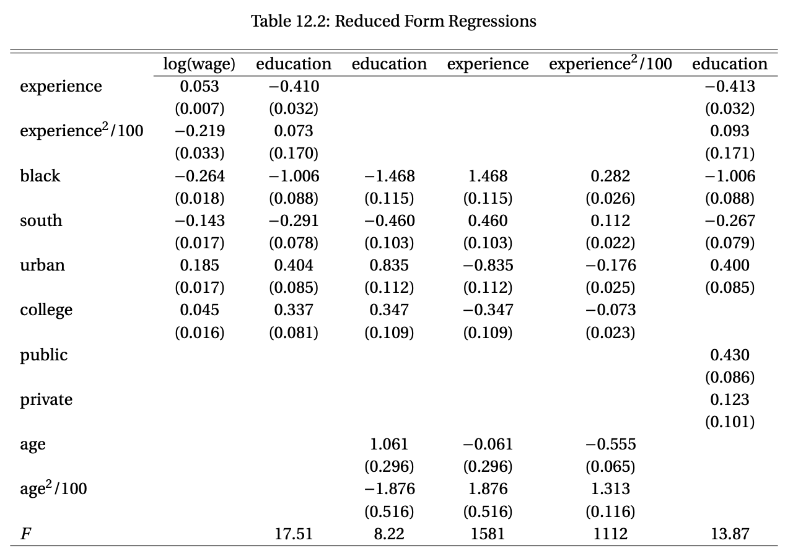
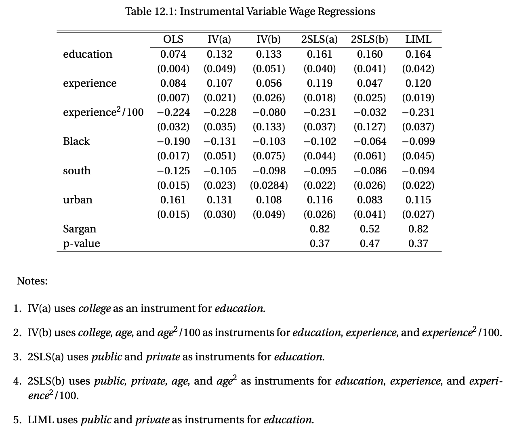

# Homework: 2024/11/20

## 1. 
Please read Section 12.6 (Example: College Proximity), Section 12.9 (Reduced-form regressions), and Section 12.31 (Sargan's over-identification test), download the dataset Card1995 from [this link](https://users.ssc.wisc.edu/~bhansen/econometrics/) and read the data description, and do this empirical exercise using R.

   1.1  **Reproduce Table 12.2** (Reduced-form regressions) except for the last row of this table (F statistics).  
   

   1.2  **Reproduce Table 12.1** (IV & 2SLS wage regressions) except for the last column of this table (LIML).
   
## 2. 
The textbook's Section 12.31 shows that, under $H_0: \mathbb{E}[Z'e] = 0$ (and the assumption of conditional homoskedasticity), Sargan's over-identification test statistic:

   $$
   S = e'Z(Z'Z)^{-1}Z'e / \hat{\sigma}^2
   $$

   has the asymptotic distribution:

   $$
   S \xrightarrow{d} \chi^2(\ell - k),
   $$

   where $Z \sim N(0, I_\ell)$ and $Q = \mathbb{E}[Z'X]$ is an $\ell \times k$ matrix with $\ell > k$. Please show that this amounts to the result:

   $$
   S \xrightarrow{d} \chi^2(\ell - k) \quad \text{under } H_0.
   $$
