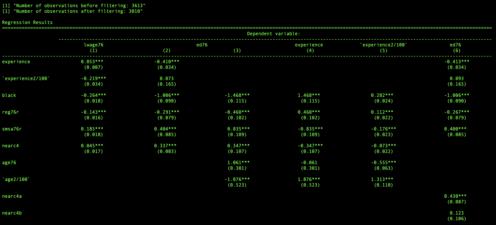
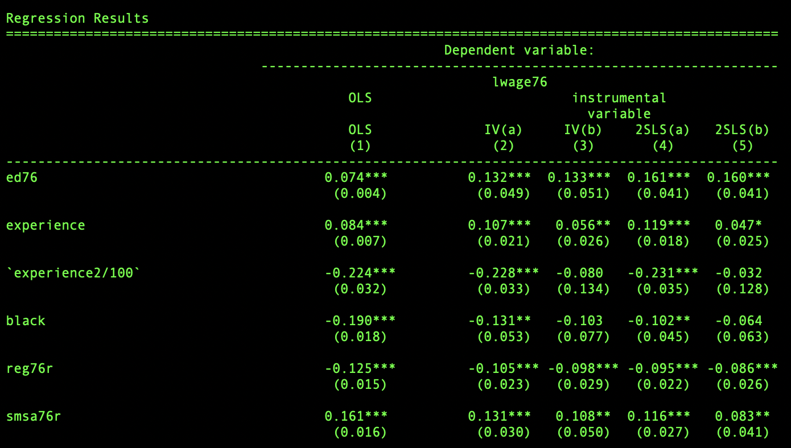
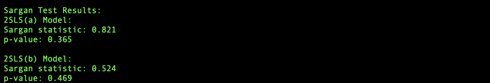
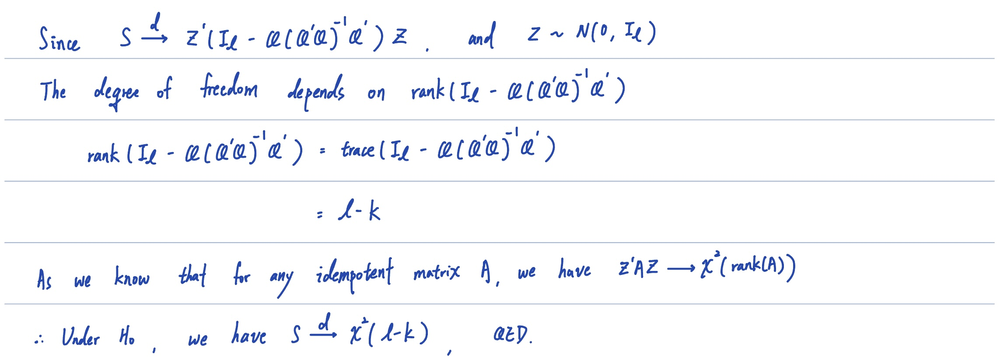

<!--   -->
# Homework: 2024/11/20

## 1-1. Reduced-form regressions
**Reproduce Table 12.2**

## 1-2. IV & 2SLS wage regressions
**Reproduce Table 12.1**

**Sargan's over-identification test**

## 2. 

## 3. Source Code

[Source Code](https://github.com/lin-1214/2024Econometric/blob/main/hw9/homework9.r)
 
